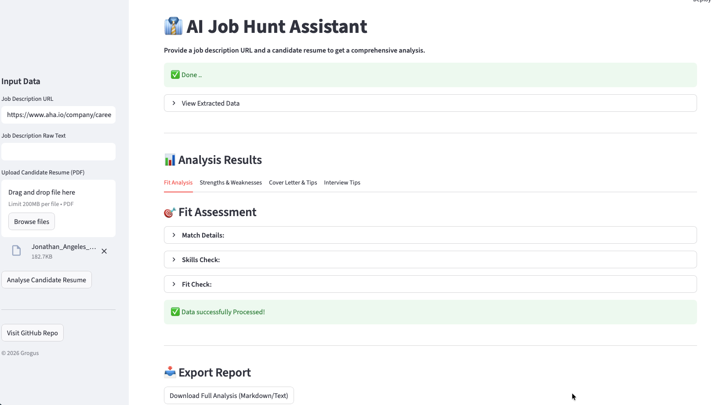

# 👔 AI Recruiter Assistant (Job Hunt Helper)
---
A professional Streamlit application powered by **LangChain** and **OpenAI (GPT-4o)**. This tool helps job seekers and recruiters analyze resumes against specific job descriptions using RAG (Retrieval-Augmented Generation).

## 🚀 Features

* **Resume Parsing:** Extracts text from PDF resumes.
* **Job Description Scraping:** automatically scrapes text from a provided Job URL.
* **AI Analysis:** Uses RAG to answer specific questions:
* ✅ Skills Gap Analysis (Table format).
* 📊 Fit Score (0-100%) with visual progress bar.
* 📈 SWOT Analysis (Strengths, Weaknesses/Opportunities).

* **Application Kit:** Generates a tailored Cover Letter and Interview Elevator Pitch.
* **Export:** Download the full analysis as a Markdown report.

## 🛠️ Tech Stack

* **Frontend:** Streamlit
* **LLM Orchestration:** LangChain
* **AI Model:** OpenAI GPT-4o
* **Vector Store:** FAISS
* **Containerization:** Docker
---

---

## ⚙️ Configuration (API Key)

This project requires an OpenAI API key to run.

1. **Get your key**: Sign up at [platform.openai.com](https://platform.openai.com/).
2. **Create the secrets file**:
Create a file named `.env` in the `src/` folder (or project root).
3. **Add your key**:
Open the `.env` file and add the following line:
```bash
OPENAI_API_KEY=sk-your-actual-api-key-here

```


> **⚠️ Security Note:** Never commit your `.env` file to GitHub. It is already included in `.gitignore`.

---

## 💻 How to Run Locally

### Prerequisites

* Python 3.13+
* Pip

### 1. Clone the Repository

```bash
git clone https://github.com/NimdaGrogu/job-hunt-assistant.git
cd job-hunt-assistant

```

### 2. Install Dependencies

```bash
pip install -r requirements.txt

```

### 3. Run the App

```bash
streamlit run src/app.py

```

*The app should open automatically at `http://localhost:8501*`

---

## 🐳 How to Run with Docker

If you prefer using Docker to ensure a consistent environment:

### 1. Build the Image

```bash
docker build -t job-hunt-assistant .

```

### 2. Run the Container

You must pass your API key to the container. We use the `--env-file` flag to pass your local secrets safely.

```bash
docker run -p 8501:8501 --env-file src/.env job-hunt-assistant

```

* **Access the app:** Open your browser to `http://localhost:8501`
* *(Note: 0.0.0.0 in the terminal logs means it is listening inside the container; you must use localhost in your browser).*

---
### 2. Docker Compose
**Assuming you are in the root directory**
```bash
docker docker compose up

```

## 📂 Project Structure

```text
job-hunt-assistant/
├── src/
│   ├── app.py           # Main application logic
│   └── .env             # API Keys (Do not commit!)
├── Dockerfile           # Docker configuration
├── requirements.txt     # Python dependencies
└── README.md            # Project documentation

```

## 🤝 Contributing

Pull requests are welcome. For major changes, please open an issue first to discuss what you would like to change.

## 📄 License

[MIT](https://choosealicense.com/licenses/mit/)