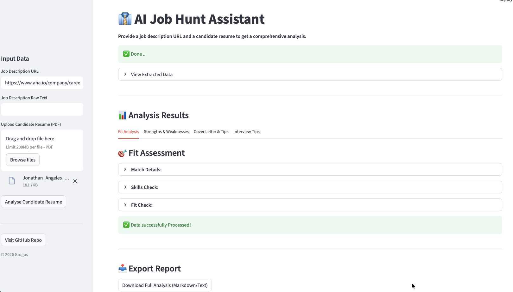

# 👔 AI Job Hunt Assistant

An intelligent, dual-purpose application designed to optimize the job search process. It combines a **RAG-powered Resume Analyzer** to evaluate candidate fit against job descriptions with an integrated **Job Application Tracker** to manage the hiring pipeline.

Built with Python, Streamlit, LangChain, and OpenAI, and fully containerized with Docker.

---
## Architecture 


## ✨ Key Features

### 🔍 1. AI Resume Analyzer
* **Semantic Match Scoring:** Uses vector embeddings (FAISS) to calculate a 0-100% quantitative fit score based on hard skills, experience, and industry context.
* **Smart PDF Parsing:** Implements layout-aware document chunking using PyMuPDF to accurately read complex, multi-column resumes without losing context.
* **Comprehensive SWOT Analysis:** Automatically generates Strengths, Weaknesses, Opportunities, and Threats for the candidate relative to the specific role.
* **Automated Application Kit:** Drafts a tailored cover letter and a STAR-method elevator pitch to prepare for interviews.
* **Exportable Reports:** Download the full analysis as a formatted Markdown file.

### 📊 2. Job Application Tracker
* **Seamless Integration:** One-click save from the Analyzer directly to your Tracker, auto-extracting the Company Name and Job Title using structured LLM outputs.
* **Visual Dashboard:** Real-time metrics and charts displaying pipeline health, interview statuses, and application momentum over time.
* **Interactive Data Editor:** Update application statuses (e.g., "Applied" -> "Interviewing") directly within the UI.
* **Persistent Storage:** Data is saved locally via CSV, ensuring your pipeline survives container restarts.

---

## 🛠️ Technology Stack
* **Frontend:** Streamlit
* **AI/LLM:** LangChain, OpenAI (`gpt-4o`, `text-embedding-3-small`)
* **Vector Database:** FAISS (Local)
* **Data Processing:** Pandas, PyMuPDF, pdfplumber
* **Deployment:** Docker & Docker Compose

---

## 🚀 Getting Started

### Prerequisites
* Docker and Docker Compose installed on your machine.
* An OpenAI API Key.

### Installation & Setup


---

> **⚠️ Security Note:** Never commit your `.env` file to GitHub. It is already included in `.gitignore`.

---

## 💻 How to Run Locally

### Prerequisites

* Python 3.13+
* Pip

### 1. Clone the Repository

```bash
git clone https://github.com/NimdaGrogu/job-hunt-assistant.git
cd job-hunt-assistant
touch src/job_tracker.csv
```
## ⚙️ Configuration (API Key)

This project requires an OpenAI API key to run.

1. **Get your key**: Sign up at [platform.openai.com](https://platform.openai.com/).
2. **Create the secrets file**:
Create a file named `.env` in the `src/` folder (or project root).
3. **Add your key**:
Open the `.env` file and add the following line:
```bash
OPENAI_API_KEY=sk-your-actual-api-key-here
VERBOSE_RAG_LOGS=false 
```
**When VERBOSE_RAG_LOGS is enabled you will see Callback in the application logs**
### 2. Install Dependencies

```bash
pip install --upgrade pip
pip install -r requirements.txt

```

### 3. Run the App

```bash
streamlit run src/app.py

```

*The app should open automatically at `http://localhost:8501*`

---

## 🐳 How to Run with Docker

If you prefer using Docker to ensure a consistent environment:

### 1. Build the Image

```bash
docker build -t job-hunt-assistant .

```

### 2. Option A Run the Container

You must pass your API key to the container. We use the `--env-file` flag to pass your local secrets safely.

```bash
docker run -p 8501:8501 --env-file src/.env job-hunt-assistant

```

* **Access the app:** Open your browser to `http://localhost:8501`
* *(Note: 0.0.0.0 in the terminal logs means it is listening inside the container; you must use localhost in your browser).*

---
### 2. Option B use Docker Compose
**Assuming you are in the root directory**
```bash
docker compose up

```

## 📂 Project Structure

```text
├── Dockerfile
├── docker-compose.yml
├── requirements.txt
└── src/
    ├── app.py                 # Main Streamlit application & routing
    ├── ingestion.py           # PDF parsing and URL scraping logic
    ├── rag_implementation.py  # FAISS vector store and LangChain logic
    ├── prompt_eng_recruiter.py# LLM Prompts and templates
    ├── helper.py              # Utility functions and parsers
    ├── job_tracker.csv        # Local database for tracked applications
    └── .env                   # Environment variables (Git-ignored)

```



## 🤝 Contributing
Next Features:

* **Session History:** Automatically saves analyzed candidates to a sidebar history, allowing recruiters to switch between profiles without re-running the analysis.
* **LLM as Judge:** Integrate Gemini LLM to perform guardrails ensuring fair evaluation of the candidate 
regardless of skin color, ethnicity, socio-economic position, and religion.

**Pull requests are welcome**. For major changes, please open an issue first to discuss what you would like to change.

**Thanks..**
## 📄 License

[MIT](https://choosealicense.com/licenses/mit/)